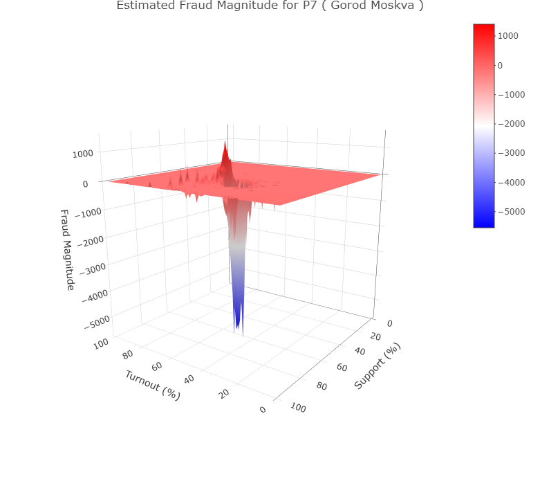

# BasicElectionForensics()

The `BasicElectionForensics` function is a comprehensive R tool designed to perform statistical analysis on election data to detect potential irregularities or fraud patterns. This function implements multiple forensic methods commonly used in election integrity research and provides both statistical results and significance testing through bootstrap methods.

```r
BasicElectionForensics(data, Candidates, Level="National", 
                      TotalReg, TotalVotes, Methods, R=1000, cores=2)
```

### Input
| Parameter | Type | Description |
|-----------|------|-------------|
| `data` | data.frame | The input dataset containing election results |
| `Candidates` | vector | Variable names referring to vote counts for candidates/parties |
| `Level` | string | Variable name depicting the level of analysis (default: "National") |
| `TotalReg` | string | Variable name for the total number of eligible voters |
| `TotalVotes` | string | Variable name for the total number of ballots cast |
| `Methods` | vector | List of forensic methods to apply (see Methods section) |
| `R` | numeric | Number of bootstrap simulations (default: 1000) |
| `cores` | numeric | Number of cores for parallel computing (default: 2) |

### Output
| Output | Type | Description |
|-----------|------|-------------|
| `table`     | `data.frame`                  | Numerical results of the election forensic tests             |
| `tex`       | `xtable`, `data.frame`        | LaTeX-formatted results table suitable for academic use      |
| `html`      | `datatables`, `htmlwidget`    | Interactive HTML table with color-coded significance         |
| `sigMatrix` | `matrix`, `array`             | Binary significance matrix for further statistical analysis  |

### Statistical Distribution Tests
- **`_2BL`** - Second-digit mean test (Benford's Law analysis)
- **`LastC`** - Last-digit mean test for uniform distribution
- **`P05s`** - Percentage last-digit 0/5 indicator (for percentages)
- **`C05s`** - Count last-digit 0/5 indicator (for vote counts)
- **`Skew`** - Skewness measure (asymmetry from normal distribution)
- **`Kurt`** - Kurtosis measure (tail heaviness compared to normal distribution)
- **`DipT`** - Unimodality test (Hartigan's dip test)
- **`Sobyanin`** - Sobyanin-Sukhovolsky measure (turnout-vote share relationship)
- **`Correlation`** - Correlation coefficient between turnout and vote share

### Key Features
- Uses nonparametric bootstrap with configurable number of simulations (R parameter)
- Provides confidence intervals for statistical significance
- Supports parallel processing for improved performance
- Works with various election data formats
- Handles missing data appropriately
- Supports multi-level analysis (e.g., national, regional, local)

### Usage Example

```r
library(EFToolkit)

# Load election data
dat <- read.csv(system.file("extdata/Albania2013.csv", package="EFToolkit"))

# Run forensics analysis
results <- BasicElectionForensics(
  dat,
  Candidates = c("C035", "C050"),
  Level = "Prefectures", 
  TotalReg = "Registered",
  TotalVotes = "Ballots",
  Methods = c("P05s", "C05s", "_2BL", "Sobyanin", 
              "DipT", "Skew", "Kurt", "Correlation"),
  cores = 2, 
  R = 100  # Reduced for faster computation in example
)

# View results
print(results$table)
```


### Interpretation Guidelines

#### Benford's Law (`_2BL`)
- **Expected**: Mean second digit ≈ 4.5
- **Suspicious**: Significant deviations from expected value
- **Indicates**: Potential data manipulation or non-natural number generation

#### Last Digit Tests (`LastC`, `P05s`, `C05s`)
- **Expected**: Uniform distribution across digits (mean ≈ 4.5 for LastC)
- **Suspicious**: Clustering around 0s and 5s, or other non-uniform patterns
- **Indicates**: Rounding, psychological biases, or deliberate manipulation

#### Distribution Shape (`Skew`, `Kurt`, `DipT`)
- **Expected**: Relatively normal distributions in natural elections
- **Suspicious**: High skewness, unusual kurtosis, or clear multimodality
- **Indicates**: Systematic vote manipulation or unusual voting patterns

#### Turnout-Vote Relationship (`Sobyanin`, `Correlation`)
- **Expected**: Weak or moderate correlations
- **Suspicious**: Strong positive correlations, especially with unusual slopes
- **Indicates**: Potential ballot stuffing or carousel voting


# BuildMap()

The `BuildMap` function is a specialized R visualization tool designed to create choropleth maps from election forensics analysis results. This function takes the output from `BasicElectionForensics()` and combines it with geographic data to produce spatial visualizations of statistical anomalies and patterns in election data.

```r
BuildMap(eforensicsdata, geodata, Geoindex, Colorsig=FALSE, xlab="")
```
### Input
| Parameter | Type | Description |
|-----------|------|-------------|
| `eforensicsdata` | list | Output object from `BasicElectionForensics()` function |
| `geodata` | sf object | Spatial data frame containing geographic boundaries |
| `Geoindex` | string | Name of index variable from sf object used to merge geodata with forensics results |
| `Colorsig` | logical | If TRUE, only statistically significant estimates are mapped (default: FALSE) |
| `xlab` | string | X-axis label or subtitle for the maps |


### Output
| Output | Type | Description |
|-----------|------|-------------|
| `figures`     | `list`                      | Collection of generated plots (either `spplot` or `tmap` objects)           |
| `Colorsig`    | `logical`                   | Indicator of whether significance-based coloring was applied (`TRUE/FALSE`) |
| `shpdata`     | `sf` (simple features)      | Spatial dataset with election forensics results merged with geodata         |
| `creationdate`| `POSIXct`       | Timestamp of when the output was created                                    |

### Key Features

#### Spatial Data Integration
- Seamlessly merges election forensics results with geographic boundaries
- Supports sf (Simple Features) spatial data format
- Handles missing data and geographic mismatches gracefully

#### Flexible Visualization Options
- **Standard Mode**: Displays all forensic values with continuous color scales
- **Significance Mode**: Highlights only statistically significant results
- Customizable color schemes using ColorBrewer palettes

#### Multi-Method Mapping
- Automatically generates maps for all forensic methods in the input data
- Creates separate visualizations for each candidate-method combination
- Supports multiple candidates and analysis levels simultaneously

### Usage Example

```r
library(EFToolkit)
library(sf)

# Load election data
dat <- read.csv(system.file("extdata/Albania2013.csv", package="EFToolkit"))

# Run forensics analysis
eldata <- BasicElectionForensics(dat,
                                Candidates=c("C035", "C050"),
                                Level="Prefectures", TotalReg="Registered",
                                TotalVotes="Ballots",
                                Methods=c("P05s", "C05s"), R=100)

# Load geographic data
geodata <- st_read(system.file("extdata/Albania2013_prefectures.shp",
                          package="EFToolkit"), quiet = TRUE)

# Create maps
figures <- BuildMap(eforensicsdata=eldata, geodata=geodata, Geoindex="Level")

# Access individual maps
print(figures$figures$Turn_P05s)  # Turnout P05s method map
print(figures$figures$C035_P05s)  # Candidate C035 P05s method map
```

The function generates choropleth maps showing spatial patterns of election forensics indicators:

| Image 1 | Image 2 | Image 3 | Image 4 |
|------------------|------------------|------------------|------------------|
| |  |  |  |


### Technical Implementation Details

#### Spatial Data Handling
- Uses `sf` package for modern spatial data processing
- Maintains coordinate reference systems throughout analysis
- Supports various geographic file formats (shapefile, GeoJSON, etc.)
- Implements ColorBrewer "OrRd" (Orange-Red) palette by default
- Provides good contrast for highlighting anomalies
- Color-blind friendly options available through ColorBrewer

#### Color Intensity Interpretation
- **Light Colors**: Values close to expected/normal ranges
- **Medium Colors**: Moderate deviations from expected patterns  
- **Dark Colors**: Strong deviations suggesting potential irregularities
- **No Color/White**: Missing data or areas excluded from analysis

#### Spatial Pattern Analysis
- **Clustering**: Adjacent areas with similar colors may indicate systematic issues
- **Isolated Anomalies**: Single areas with extreme values warrant individual investigation
- **Border Effects**: Patterns along administrative boundaries may suggest institutional factors
- **Urban/Rural Differences**: Different patterns by area type are common


# ClusterAnalysis()

The `ClusterAnalysis` function implements sophisticated spatial clustering tests to identify geographic patterns and anomalies in election forensics data. This function uses two complementary statistical methods - Getis-Ord Gi* and Local Moran's I - to detect spatial clusters of unusual values, helping researchers identify areas where election irregularities may be spatially correlated.

```r
ClusterAnalysis(geodata, Vars, IndexCL=NULL, cores=2)
```
### Input

| Parameter | Type | Description |
|-----------|------|-------------|
| `geodata` | sf object/list | Spatial data within a list (supports both polygon and point sf objects) or BuildMap object |
| `Vars` | character vector | Variable names used for geographic clustering tests |
| `IndexCL` | string | Index variable name used for merging polygon and point sf objects (optional) |
| `cores` | numeric | Number of cores for parallel computing (default: 2) |

### Output

| Output | Type | Description |
|-----------|------|-------------|
| `Moran's I for <Var>`               | `ggplot`      | A `ggplot` map visualizing local Moran’s I cluster results for variable `<Var>`. |
| `Getis-Ord for <Var>`               | `ggplot`      | A `ggplot` map visualizing Getis-Ord G* hot- and cold-spots for variable `<Var>`. |


### Spatial Clustering Methods

#### Local Moran's I
- **Purpose**: Identifies local clusters and spatial outliers
- **Detects**: Four types of spatial associations:
  - **HH (High-High)**: High values surrounded by high values
  - **LL (Low-Low)**: Low values surrounded by low values  
  - **HL (High-Low)**: High values surrounded by low values
  - **LH (Low-High)**: Low values surrounded by high values

#### Getis-Ord Gi* Statistic
- **Purpose**: Identifies hot spots and cold spots
- **Detects**: Two types of spatial concentrations:
  - **Hot Spots**: Areas with significantly high values clustered together
  - **Cold Spots**: Areas with significantly low values clustered together


The function generates spatial cluster analysis maps showing different types of spatial patterns:

| Image 1 |  Image 2 |  Image 3 |  Image 4 |
|------------------|------------------|------------------|------------------|
|  |  |  |  |

[Spatial clustering analysis](inst/figures/img4.png)
*Spatial clustering analysis for Albanian election data - (1) Local Moran's I for P05s method, (2) Getis-Ord hot/cold spots for P05s, (3) Local Moran's I for C05s method, (4) Getis-Ord analysis for C05s method*


```r
library(EFToolkit)
library(sf)

# Load election data
dat <- read.csv(system.file("extdata/Albania2013.csv", package="EFToolkit"))

# Obtain election forensics estimates
eldata <- BasicElectionForensics(dat,
                                Candidates=c("C035", "C050"),
                                Level="Prefectures", TotalReg="Registered",
                                TotalVotes="Ballots",
                                Methods=c("P05s", "C05s"), R=100)

# Create the map with results
geodata <- st_read(system.file("extdata/Albania2013_prefectures.shp", 
                              package="EFToolkit"), quiet = TRUE)
figures <- BuildMap(eforensicsdata=eldata, geodata=geodata, 
                   Geoindex="Level", Colorsig=FALSE)

# Using the mapped results, implement cluster analysis
cluster_results <- ClusterAnalysis(figures, Vars=c("C050_P05s", "C050_C05s"))

# View specific cluster maps
print(cluster_results[["Moran's I for C050_P05s"]])
print(cluster_results[["Getis-Ord for C050_P05s"]])
```

### Key Features

#### Advanced Spatial Statistics
- **Permutation-based Testing**: Uses Monte Carlo permutation tests for statistical significance
- **False Discovery Rate Control**: Implements Benjamini-Hochberg FDR correction for multiple testing
- **Parallel Processing**: Supports multi-core computation for large datasets

#### Flexible Input Handling
- **Multiple Data Types**: Works with polygon and point spatial data
- **Integration Ready**: Seamlessly processes BuildMap function outputs
- **Missing Data Handling**: Robust treatment of missing or invalid data points

#### Comprehensive Visualization
- **Color-coded Results**: Uses standardized color schemes for easy interpretation
- **Multiple Significance Levels**: Shows results at 90%, 95%, and 99% confidence levels
- **Interactive Plotting**: Generates ggplot2 objects for further customization

### Color Coding System

#### Local Moran's I Colors
| Pattern | 99% Level | 95% Level | 90% Level | Description |
|---------|-----------|-----------|-----------|-------------|
| **HH** | Dark Red | Light Red | Pink | High-High clusters |
| **LL** | Dark Blue | Light Blue | Light Gray | Low-Low clusters |
| **HL** | Dark Orange | Light Orange | Yellow | High-Low outliers |
| **LH** | Dark Green | Light Green | Light Green | Low-High outliers |
| **NS** | Light Gray | Light Gray | Light Gray | Not significant |

#### Getis-Ord Gi* Colors
| Pattern | Description | Color |
|---------|-------------|-------|
| **Hot Spot (99%)** | Highly significant hot spot | Dark Red |
| **Hot Spot (95%)** | Significant hot spot | Medium Red |
| **Hot Spot (90%)** | Moderately significant hot spot | Light Red |
| **Cold Spot (99%)** | Highly significant cold spot | Dark Blue |
| **Cold Spot (95%)** | Significant cold spot | Medium Blue |
| **Cold Spot (90%)** | Moderately significant cold spot | Light Blue |
| **Not Significant** | No significant clustering | Light Gray |

#### Local Moran's I Results
- **High-High Clusters (Red)**: Areas with high forensic values surrounded by similar high values
  - *Interpretation*: Potential systematic irregularities in neighboring areas
  - *Action*: Priority areas for detailed investigation

- **Low-Low Clusters (Blue)**: Areas with low forensic values surrounded by similar low values
  - *Interpretation*: Regions with consistently normal patterns
  - *Action*: Lower priority for investigation

- **High-Low Outliers (Orange)**: High values surrounded by low values
  - *Interpretation*: Isolated anomalies or data quality issues
  - *Action*: Investigate for administrative or data collection problems

- **Low-High Outliers (Green)**: Low values surrounded by high values
  - *Interpretation*: Unusually clean areas within problematic regions
  - *Action*: Verify data accuracy or investigate protective factors

#### Getis-Ord Results
- **Hot Spots (Red Shades)**: Statistically significant concentrations of high values
  - *Interpretation*: Geographic clustering of potential irregularities
  - *Action*: Focus investigative resources on these areas

- **Cold Spots (Blue Shades)**: Statistically significant concentrations of low values
  - *Interpretation*: Areas with consistently normal electoral patterns
  - *Action*: Use as baseline comparisons or control areas


# NonparamElectionForensics()

The `NonparamElectionForensics` function implements a revised version of Shpilkin's method for detecting election fraud through nonparametric analysis of vote distributions. This method identifies anomalous voting patterns by analyzing the relationship between turnout and candidate support, detecting artificial vote inflation through statistical modeling of "clean" electoral behavior.


```r
NonparamElectionForensics(data, Candidates, CandidatesText=NULL,
                         MainCandidate, TotalReg, TotalVotes=NULL,
                         Level=NULL, MaxThreshold=0.8,
                         FigureName, setcolors=NULL,
                         precinctLevel=TRUE, computeSD=NULL,
                         sims=10, mode_search=list(npeaks=5, sortstr=TRUE,
                                                  minpeakdistance=1, pick_by="height"),
                         man_turnout=NULL, grid_type="1D")
```

### Input


| Parameter       | Type        | Description |
|-----------------|-------------|-------------|
| `data`          | data.frame  | Electoral data containing vote counts and registration information |
| `Candidates`    | vector      | Variable names for all candidates/parties in the election |
| `CandidatesText`| vector      | Display names for candidates/parties (uses `Candidates` if NULL) (default: NULL) |
| `MainCandidate` | string      | Variable name for main/incumbent candidate |
| `TotalReg`      | string      | Variable name for total number of eligible voters |
| `TotalVotes`    | string      | Variable name for total ballots cast (computed from candidates if NULL) (default: NULL) |
| `Level`         | string      | Variable for analysis level (default: "National") |
| `MaxThreshold`  | numeric     | Anomalous turnout threshold (default: 0.8) |
| `FigureName`    | string      | Title for generated figures |
| `setcolors`     | vector      | Custom color palette (random if NULL) (default: NULL) |
| `precinctLevel` | logical     | Whether to compute precinct-level estimates (default: TRUE) |
| `computeSD`     | string      | Standard error method: "parametric" or "nonparametric" (default: NULL) |
| `sims`          | numeric     | Number of simulations for uncertainty estimation (default: 10) |
| `mode_search`   | list        | Clean peak search parameters |
| `man_turnout`   | numeric     | Manual clean peak turnout override (default: NULL) |
| `grid_type`     | string      | Estimation approach: "1D" or "2D" (default: "1D") |


The `mode_search` parameter accepts a list with the following components:

| Parameter | Description |
|-----------|-------------|
| `npeaks` | Maximum number of peaks to identify |
| `sortstr` | Whether to sort peaks by strength |
| `minpeakdistance` | Minimum distance between peaks |
| `pick_by` | Peak selection method: "area", "height", "cluster", "quantile", or "elipse" |


### Output

| Output | Type | Description |
|--------|------|-------------|
| `list_graphs` | list | Collection of generated plots (ggplot2/plotly objects) |
| `base_stats` | list | Basic fraud statistics for the whole dataset |
| `sim_all_stats` | list | Simulation statistics for the whole dataset (if computeSD specified) |
| `sim_hetero_stats_base` | data.frame | Base statistics for regional analyses (if Level != "National") |
| `sim_hetero_stats_sims` | data.frame | Simulation statistics for regional analyses (if Level != "National") |
| `fraud_precinct_data` | data.frame | Precinct-level fraud estimates with uncertainty measures |
| `data` | data.frame | Original input data with computed variables |
| `Level` | character | Analysis level used in the function |
| `creationdate` | POSIXct | Timestamp of when the output was created |


#### Precinct-Level Fraud Data Structure

When `precinctLevel=TRUE`, the `fraud_precinct_data` component contains:

| Column | Description |
|--------|-------------|
| `id` | Unique precinct identifier |
| `base.fraud.votes` | Point estimate of fraudulent votes |
| `sim.precinct_mean` | Mean fraud estimate from simulations |
| `sim.precinct_sd` | Standard deviation of fraud estimates |
| `sim.sig_all` | Statistical significance indicator |
| `precinct_mean_hetero` | Regional-level fraud estimates (when Level != "National") |

#### Primary Outputs
- **Official Turnout**: Reported voter participation rate
- **Real Turnout**: Estimated legitimate turnout (clean peak)
- **Official Support**: Reported candidate vote share
- **Real Support**: Estimated legitimate support in clean regions
- **Ballot Stuffing**: Votes added through turnout inflation
- **Ballot Switching**: Votes transferred between candidates
- **Total Fraud**: Combined fraudulent votes
- **Proportional Fraud**: Fraud as percentage of total votes

#### Uncertainty Quantification
When `computeSD` is specified, the function provides:

- **Parametric**: Assumes binomial distributions for vote generation
- **Nonparametric**: Uses bootstrap resampling for robust estimates


#### Clean Peak Detection Methods
- **"height"**: Selects clean peak with highest vote count
- **"area"**: Chooses clean peak with largest area under curve
- **"cluster"**: Uses clustering to identify clean peak
- **"quantile"**: Employs mixture models on turnout distribution for clean peak detection
- **"elipse"**: Uses robust covariance estimation for clean peak detection

#### Grid Types
- **1D Grid**: Uses 1D grid of turnout distribution to identify clean peak
- **2D Method**: Uses 2D grid of joint distribution of turnout and incumbent's vote share


### Example 1: National-Level Analysis with 1D Grid

```r
library(EFToolkit)

# Load Russian 2000 election data
dat <- read.csv("electionfraud2000.csv")

# National analysis using 1D estimation method
res1 <- NonparamElectionForensics(dat, 
                                 Candidates = paste("P", 1:12, sep=""),
                                 CandidatesText = c("Stanislav Govorukhin", "Umar Dzhabrailov",  
                                                    "Vladimir Zhirinovsky", "Gennady Zuganov", 
                                                    "Ella Pamfilova", "Alexei Podberezkin", 
                                                    "Vladimir Putin", "Yuri Skuratov",
                                                    "Konstantin Titov", "Aman Tuleev",
                                                    "Grigorii Yavlinsky", "Against All"),
                                 MainCandidate = "P7",
                                 TotalReg = "NVoters",
                                 TotalVotes = "NValid",
                                 Level = "National",
                                 MaxThreshold = 0.8,
                                 mode_search = list(npeaks = 5, sortstr = TRUE,
                                                    minpeakdistance = 1, pick_by = "height"),
                                 FigureName = "Russian Presidential Elections, 2000",
                                 setcolors = c("royalblue2", "springgreen1","blue", 
                                               "red", "green","brown2",
                                               "darkgreen", "yellow", "lawngreen", 
                                               "purple","chartreuse1", "orange"),
                                 precinctLevel = TRUE, 
                                 computeSD = "nonparametric",
                                 sims = 10, 
                                 grid_type = "1D")

# Summary of precinct-level fraud estimates
total_fraud <- sum(res1$fraud_precinct_data$base.fraud.votes, na.rm=TRUE)
# Result: 2,685,246 fraudulent votes detected

# Statistically significant fraud only
significant_fraud <- sum(res1$fraud_precinct_data$sim.precinct_mean[
  res1$fraud_precinct_data$sim.sig_all==TRUE], na.rm=TRUE)
# Result: 811,501 significant fraudulent votes

> res1$base_stats
$`Whole dataset`
official_turnout     real_turnout official_support     real_support  ballot_stuffing ballot_switching 
    6.820000e+01     6.700000e+01     5.330000e+01     5.200000e+01     1.258868e+06     1.426378e+06 
     total_fraud       prop_fraud 
    2.685246e+06     6.990511e-02 
    
# Display the table of region-level measures
View(round(res1$sim_hetero_stats_base, 3))

```

| Image 1 | Image 2 | Image 3 |
|------------------|------------------|------------------|
| |  |  |


### Example 2: Regional-Level Analysis with 1D Grid

```r
# Regional analysis across all federal subjects
res2 <- NonparamElectionForensics(dat, 
                                 Candidates = paste("P", 1:12, sep=""),
                                 CandidatesText = c("Stanislav Govorukhin", "Umar Dzhabrailov",  
                                                    "Vladimir Zhirinovsky", "Gennady Zuganov", 
                                                    "Ella Pamfilova", "Alexei Podberezkin", 
                                                    "Vladimir Putin", "Yuri Skuratov",
                                                    "Konstantin Titov", "Aman Tuleev",
                                                    "Grigorii Yavlinsky", "Against All"),
                                 MainCandidate = "P7",
                                 TotalReg = "NVoters",
                                 TotalVotes = "NValid",
                                 Level = "regname",  # Regional analysis
                                 MaxThreshold = 0.8,
                                 mode_search = list(npeaks = 5, sortstr = TRUE,
                                                    minpeakdistance = 1, pick_by = "height"),
                                 FigureName = "Russian Presidential Elections, 2000",
                                 setcolors = c("royalblue2", "springgreen1","blue", 
                                               "red", "green","brown2",
                                               "darkgreen", "yellow", "lawngreen", 
                                               "purple","chartreuse1", "orange"),
                                 precinctLevel = TRUE, 
                                 computeSD = "nonparametric",
                                 sims = 10, 
                                 grid_type = "1D")

# Regional fraud estimates
regional_fraud <- sum(res2$fraud_precinct_data$precinct_mean_hetero, na.rm=TRUE)
# Result: 1,693,742 fraudulent votes across regions

# Statistically significant regional fraud
significant_regional_fraud <- sum(res2$fraud_precinct_data$precinct_mean_hetero[
  res2$fraud_precinct_data$sim.sig_all==TRUE], na.rm=TRUE)
# Result: 1,125,151 significant fraudulent votes
```

| Image 1 | Image 2 | Image 3 | Image 4 |
|------------------|------------------|------------------|------------------|
| |  |  |  |


### Example 3: National Analysis with 2D Grid

```r
# 2D analysis using parametric uncertainty estimation
res3 <- NonparamElectionForensics(dat, 
                                 Candidates = paste("P", 1:12, sep=""),
                                 CandidatesText = c("Stanislav Govorukhin", "Umar Dzhabrailov",  
                                                    "Vladimir Zhirinovsky", "Gennady Zuganov", 
                                                    "Ella Pamfilova", "Alexei Podberezkin", 
                                                    "Vladimir Putin", "Yuri Skuratov",
                                                    "Konstantin Titov", "Aman Tuleev",
                                                    "Grigorii Yavlinsky", "Against All"),
                                 MainCandidate = "P7",
                                 TotalReg = "NVoters",
                                 TotalVotes = "NValid",
                                 Level = "National",
                                 MaxThreshold = 0.8,
                                 mode_search = list(npeaks = 5, sortstr = TRUE,
                                                    minpeakdistance = 1, pick_by = "height"),
                                 FigureName = "Russian Presidential Elections, 2000",
                                 setcolors = c("royalblue2", "springgreen1","blue", 
                                               "red", "green","brown2",
                                               "darkgreen", "yellow", "lawngreen", 
                                               "purple","chartreuse1", "orange"),
                                 precinctLevel = TRUE, 
                                 computeSD = "parametric",
                                 sims = 10, 
                                 grid_type = "2D")

# 2D method fraud estimates
fraud_2d <- sum(res3$fraud_precinct_data$sim.precinct_mean, na.rm=TRUE)
# Result: -15,724,742 (negative values suggest model limitations)

# Significant fraud in 2D analysis
significant_2d_fraud <- sum(res3$fraud_precinct_data$sim.precinct_mean[
  res3$fraud_precinct_data$sim.sig_all==TRUE], na.rm=TRUE)
# Result: 0 (no significant fraud detected with 2D method)

# Display the table of region-level measures
View(round(res3$sim_hetero_stats_base, 3))
```

| Image 1 | Image 2 | Image 3 |
|------------------|------------------|------------------|
| |  |  |


### Example 4: Analysis of Selected Regions with 2D Grid

```r
# Focus on specific regions of interest
selected_regions <- c("Respublika Dagestan", "Gorod Moskva", 
                      "Samarskaya Oblast`", "Volgogradskaya Oblast`")  
dat_subset <- dat[dat$regname %in% selected_regions,]

res4 <- NonparamElectionForensics(dat_subset, 
                                 Candidates = paste("P", 1:12, sep=""),
                                 CandidatesText = c("Stanislav Govorukhin", "Umar Dzhabrailov",  
                                                    "Vladimir Zhirinovsky", "Gennady Zuganov", 
                                                    "Ella Pamfilova", "Alexei Podberezkin", 
                                                    "Vladimir Putin", "Yuri Skuratov",
                                                    "Konstantin Titov", "Aman Tuleev",
                                                    "Grigorii Yavlinsky", "Against All"),
                                 MainCandidate = "P7",
                                 TotalReg = "NVoters",
                                 TotalVotes = "NValid",
                                 Level = "regname",
                                 MaxThreshold = 0.8,
                                 mode_search = list(npeaks = 5, sortstr = TRUE,
                                                    minpeakdistance = 1, pick_by = "height"),
                                 FigureName = "Russian Presidential Elections, 2000",
                                 setcolors = c("royalblue2", "springgreen1","blue", 
                                               "red", "green","brown2",
                                               "darkgreen", "yellow", "lawngreen", 
                                               "purple","chartreuse1", "orange"),
                                 precinctLevel = TRUE, 
                                 computeSD = "nonparametric",
                                 sims = 10, 
                                 grid_type = "2D")

# Access regional comparison results
print(res4$stats_summary)
```

| Image 1 | Image 2 | Image 3 |
|------------------|------------------|------------------|
| |  |  |


| Image 4 | Image 5 | Image 6 |
|------------------|------------------|------------------|
| |  |  |


### Advanced Features

#### Multi-Level Analysis
When `Level` parameter specifies administrative units, the function:
- Performs analysis for the entire dataset
- Conducts separate analyses for each administrative unit
- Aggregates results across regions
- Provides comparative statistics

#### Robust Peak Detection
The algorithm implements multiple fallback strategies:
1. Primary method specified in `pick_by`
2. Alternative clustering approaches if primary fails
3. Simple peak detection as ultimate fallback
4. Manual override through `man_turnout` parameter

#### Precinct-Level Estimation
When `precinctLevel=TRUE`, the function:
- Estimates fraud at individual precinct level
- Uses post-stratification for statistical adjustment
- Provides significance testing for precinct estimates
- Enables spatial analysis integration

### Best Practices

#### Method Selection
1. **Start with 1D analysis** for initial exploration
2. **Use regional-level analysis** for heterogeneous countries
3. **Apply nonparametric uncertainty** for robust estimates
4. **Test multiple `pick_by` methods** for sensitivity analysis

#### Parameter Tuning
1. **Increase `sims`** for more precise uncertainty estimates
2. **Adjust `MaxThreshold`** based on country-specific context
3. **Experiment with `mode_search`** parameters for optimal peak detection
4. **Use custom `setcolors`** for publication-quality visualizations

#### Result Validation
1. **Compare across estimation methods** (1D vs 2D)
2. **Examine statistical significance** alongside magnitude
3. **Cross-validate with other forensic indicators**
4. **Consider substantive electoral context**


# Finite Mixture Model()

**`ComputeFiniteMixtureModel`** - A legacy implementation of Walter Mebane's Finite Mixture Model for electoral data analysis.

The model uses Bayesian estimation techniques with EM-algorithm-like iterations to estimate the posterior probabilities of each precinct belonging to each fraud category.


> ⚠️ **Important Note**: This function is **legacy code** that is no longer actively maintained or supported. It may have dependencies on outdated packages or contain unoptimized algorithms.

```r
ComputeFiniteMixtureModel(dat, MainCandidate = "Votes", TotalReg = "NVoters", 
                         TotalVotes = "NValid", cores = 2, itstartmax = 1)
```

### Input

| Parameter | Type | Description |
|-----------|------|-------------|
| `dat` | data.frame | Electoral dataset containing voting data |
| `MainCandidate` | character | Variable name for the major/incumbent candidate votes (default: "Votes") |
| `TotalReg` | character | Variable name for total number of eligible voters (default: "NVoters") |
| `TotalVotes` | character | Variable name for total number of ballots cast (default:  "NValid")|
| `cores` | integer | Number of cores for parallel computing (default:2)|
| `itstartmax` | integer | Maximum number of iterations for optimization (default: 1)|

### Output

Returns a list containing FMM estimates with the following structure:

```r
list(
  FF_null = matrix,    # Null model results (estimates and standard deviations)
  FFlist_null = list,  # Full null model output including posterior probabilities
  FF = matrix,         # Main model results (estimates and standard deviations)
  FFlist = list        # Full main model output including posterior probabilities
)
```

The output matrices contain the following parameters:

| Parameter | Description |
|-----------|-------------|
| `incremental` | Proportion of incremental fraud |
| `extreme` | Proportion of extreme fraud |
| `alpha` | Fraud intensity parameter |
| `turnout` | Turnout rate parameter |
| `winprop` | Winning proportion parameter |
| `sigma` | Standard deviation for vote proportions |
| `stdAtt` | Standard deviation for attendance |
| `theta` | Convergence test parameter |
| `loglik` | Log-likelihood value |
| `df` | Degrees of freedom |


### Usage Example

```r
library(EFToolkit)

# Load sample data
dat <- read.csv(system.file("extdata/ruspres2020.csv", package = "EFToolkit"))
dat <- subset(dat, select = c("region", "NVoters", "NValid", "Votes"))
datc <- dat[dat$region == "Volgogradskaya Oblast`", ]

# Run FMM analysis (commented out due to long computation time)
# res <- ComputeFiniteMixtureModel(datc,
#                                 MainCandidate = "Votes",
#                                 TotalReg = "NVoters", 
#                                 TotalVotes = "NValid")
```

### Key Features

- **Mixture Modeling**: Implements a finite mixture model with multiple fraud components
- **Parallel Computing**: Supports multi-core processing for faster computation
- **Robust Estimation**: Uses genetic algorithms (`rgenoud`) for parameter optimization
- **Statistical Inference**: Provides estimates with standard errors

### Limitations & Considerations

1. **Computational Intensity**: The function can be very slow for large datasets
2. **Legacy Status**: No longer actively supported or maintained
3. **Algorithm Complexity**: Implements sophisticated statistical models that may require domain expertise to interpret
4. **Parameter Sensitivity**: Results may be sensitive to starting values and iteration limits


# Klimek Model()

**`ComputeKlimekModel`** - Implements the Klimek et al. (2012) simulation-based method for detecting electoral anomalies through histogram analysis of vote distributions.

> ⚠️ **Legacy Function Notice**: This function is **legacy code** that is no longer actively maintained or supported. It remains available for historical reference and research reproducibility but may have dependencies on outdated packages or contain unoptimized algorithms.

### Key Features:
- **Histogram-based analysis**: Compares observed vote distributions with simulated ones
- **Fraud simulation**: Models incremental and extreme fraud scenarios
- **Parameter estimation**: Estimates fraud parameters through iterative simulation
- **Statistical testing**: Uses chi-square goodness-of-fit tests to evaluate model fit

```r
ComputeKlimekModel(data, Candidates, Level = "National", TotalReg, TotalVotes, 
                   R = 1000, cores = 2)
```

### Input

| Parameter | Description |
|-----------|-------------|
| `data` | Data frame containing electoral data |
| `Candidates` | Variable name(s) for vote counts of candidates/parties |
| `Level` | Variable indicating geographic level of analysis (default: "National") |
| `TotalReg` | Variable name for total number of eligible voters |
| `TotalVotes` | Variable name for total number of ballots cast |
| `R` | Number of simulations to run (default: 1000) |
| `cores` | Number of CPU cores for parallel computation (default: 2) |

### Output

| Column | Description |
|--------|-------------|
| `Level` | Geographic level of analysis |
| `Candidate` | Candidate/party name |
| `KSimI` | Estimated proportion of incremental fraud |
| `KSimE` | Estimated proportion of extreme fraud |
| `KSimalpha` | Fraud intensity parameter |
| `KSimturnout` | Estimated turnout rate parameter |
| `KSimwinprop` | Estimated winning proportion parameter |
| `KSimsigma` | Standard deviation for vote proportions |
| `KSimstdAtt` | Standard deviation for attendance rates |
| `KSimtheta` | Convergence test parameter |
| `Obs` | Number of observations used in analysis |

### Usage Example

```r
library(EFToolkit)

# Load sample data
dat <- read.csv(system.file("Albania2013.csv", package = "EFToolkit"))

# Run Klimek analysis with reduced simulations for speed
klimek <- ComputeKlimekModel(dat, 
                            Candidates = "C050", 
                            Level = "National",
                            TotalReg = "Registered", 
                            TotalVotes = "Ballots", 
                            cores = 1, 
                            R = 100)

# Access results
print(klimek$table)      # Data frame with results
print(klimek$html)       # HTML formatted table
print(klimek$tex)        # LaTeX formatted table
```

The function computes several goodness-of-fit measures:

- **Winner.HFit.Klimek**: Histogram fit statistic for winning candidate
- **Winner.HFit.chi2**: Chi-square histogram fit
- **Winner.Fit.chi2**: Chi-square vote count fit
- **Overall chi2**: Comprehensive model fit statistic

### Key Functions:
- **`Estimate()`**: Initial parameter estimation from vote distributions
- **`Sim_Vote()`**: Simulates electoral outcomes under fraud scenarios
- **`Sim.Histo()`**: Generates histogram distributions from simulated data
- **`Iteration_sim()`**: Main optimization loop for parameter estimation

### Simulation Parameters:
- **f1range**: Incremental fraud proportion range (0.0 to 1.0)
- **f2range**: Extreme fraud proportion range (0.0 to 0.3)  
- **arange**: Fraud intensity range (0.5 to 1.0)
- **iterations**: Number of optimization iterations (default: 10)

### Interpretation Guidelines

- **Low fraud estimates** (KSimI, KSimE near 0): Suggest clean election
- **High incremental fraud**: Indicates widespread small-scale manipulation
- **High extreme fraud**: Suggests concentrated large-scale fraud
- **Model fit statistics**: Lower values indicate better model fit to observed data
